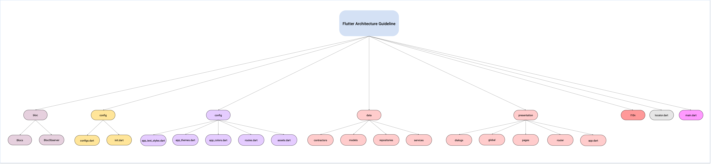

# Flutter Architecture Guideline


### It is the folder architecture created by my approach. It maybe useful with your contribution to improve architecture. Let's explain about each part more deeply.

> Keep in mind that, following numbered parts are folders.
--------

## 1. bloc
This is layer is used to handle logical operations. It maybe other state management too. It consists of 2 parts:

- Blocs

For each bloc, I create folder and it contains cubit or bloc, events and states.

```
- login
  - login_bloc (login_cubit)
  - login_event
  - login_state
```

- Bloc Observer (optional)
BlocObserver is simple delegate to handle all operations of Bloc in one place.


