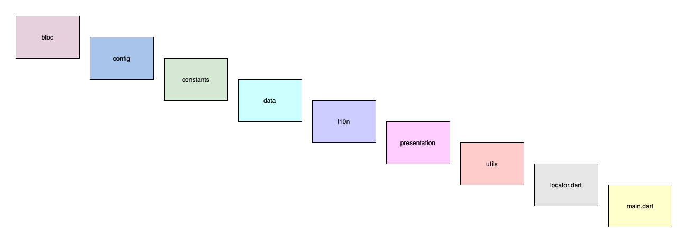

# Flutter Architecture Guideline


### It is the folder architecture created by my approach. It maybe useful with your contribution to improve architecture. Let's explain about each part more deeply.

> Keep in mind that, following numbered parts are folders or dart files.
--------

## 1. bloc
This is layer is used to handle logical operations. It maybe other state management too. It consists of 2 parts:

- Blocs

For each bloc, I create folder and it contains cubit or bloc, events and states.

```
- login
  - login_bloc (login_cubit)
  - login_event
  - login_state
```

- Bloc Observer (optional)
BlocObserver is simple delegate to handle all operations of Bloc in one place. You can learn about Bloc using [this link](https://www.youtube.com/watch?v=w6XWjpBK4W8&list=PLptHs0ZDJKt_T-oNj_6Q98v-tBnVf-S_o).
--------
## 2. config
Configrations are added to this folder. It contains the followings:

- config.dart
We can store main configrations in this file:
```dart
class Configs {
  Configs._();

  static const String SENTRY_DSN ='...';
  static const bool enableLogging = kDebugMode;
  static const String baseUrl = '...';
}
```
- init.dart
This file contains simple method that initializes all services and needed things before app started:
```dart
Future<void> init() async {
  WidgetsFlutterBinding.ensureInitialized();
  
  final locator = Locator.instance;
  final dio = Dio();
  
  if(Configs.enableLogging) {
    LoggingService(Configs.enableLogging);
    Bloc.observer = AppBlocObserver();
    dio.interceptors.add(LogInterceptorService());
  }
  
  locator.register<AuthService>(AuthService(dio));
   await locator.registerAsync<PreferencesService>(() async {
    final instance = PreferencesService.instance;
    await instance.init();
    return instance;
  });
}
```
--------
## 3. constants
As a name implies we store contants of app in this folder. It maybe followings and more:

- **app_text_styles.dart**

Text styles of app are stored in this folder:
```dart
class AppTextStyles {
  const AppTextStyles._();

  static const interW500 = TextStyle(
    fontWeight: FontWeight.w500,
    fontStyle: FontStyle.normal,
  );
}
```

- **app_themes.dart**

This file can contain light and dart theme details:
```dart
class AppThemes {
 AppThemes._();

  static final theme = ThemeData(
    fontFamily: Assets.fonts.fontFamily,
    primaryColor: AppColors.primary,
    accentColor: AppColors.primary,
    scaffoldBackgroundColor: Colors.white,
    textTheme: TextTheme(
      bodyText1: AppTextStyles.interW500.copyWith(color: AppColors.altoBlack),
    ),
  );
}
```

- **app_colors.dart**

It just contains colors of app:
```dart
class AppColors {
  const AppColors._();

  static const navyGrey = Color.fromRGBO(129, 140, 153, 1);
  static const greenGradient = Color(0xffF0FAEA);
}
```

- **routes.dart**

This file stores static paths of app for routing:
```dart
class Routes {
  const Routes._();

  static const String signIn = '/signIn';
  static const String goods = '/goods';
}
```

- **assets.dart**

To access assets easily, we can store them in one place like this:
```dart
class Assets {
  const Assets._();

  static final images = Images._();
  static final sounds = Sounds._();
  static final fonts = Fonts._();
}

@protected
class Images {
  Images._();

  static final _basePath = 'assets/images';
  
  final icon = '$_basePath/icon.png';
}

@protected
class Sounds {
  const Sounds._();
}

@protected
class Fonts {
  Fonts._();

  final fontFamily = 'Inter';
}
```
--------
## 4. data
This is the one of the most useful part of app. It contains all data and its processes.

- **contractors**

It is like a protocol or interface (abstract class in Dart) to follow SOLID principles:

```dart 
base_auth_repository.dart

abstract class BaseAuthRepository {
  Future<Response> login();

  Future<void> logOut();
}
```
> It will be used by `repositories` as interfaces to follow rules. If we need adad something to `repositories`, first we will add it to contractors.
> I mainly advice to divide contractors correctly - auth, orders, users and etc.

- **models**

As name implies, it is just simple entity container. You can divide it to 2 folders like - `response` and `request` models.
```
- models
  - response
    order_details.dart
  - request
    order_details_request_body.dart
```

- **repositories**
It is just implementations of contractors. then, it will be injected to Blocs using contractors reference (look at DI (Dependency Inversion) principle of SOLID).

> Keep in mind that it can access to all services (next part).

```dart
class AuthRepository implements BaseAuthRepository {
 final _authService = locator.get<AuthService>();
 
  Future<Response> login() {
    ...
   return _authService.login();
  }

  Future<void> logOut() {
    ...
    return _authService.logOut();
  }
}
```

- **services**

Services maybe all things like - data services that fetching data from api, database, payment service, location service or someting else. I usually use `retrofit` to write api methods fastly. And we should register services in `init.dart` by locator (getIt or someting else) to use inside app.

```dart
@RestApi(baseUrl: Configs.baseUrl)
abstract class AuthService {
  factory AuthService(Dio dio, {String baseUrl}) = _AuthService;

  @POST('/login')
  Future<Response> login();
}
```
--------
## 5. **l10n**

It is the new localization approach of Flutter. This folder just stores `*.arb` files for different languages. You can read about it from [here](https://docs.google.com/document/d/10e0saTfAv32OZLRmONy866vnaw0I2jwL8zukykpgWBc/edit). 

--------
## 6. presentation
Presentation contains all UI codes and integration with blocs. It is divided into different parts.

- **dialogs**

You can apart your dialogs code like pages in other place to handle easly:

> For each dialog, pages me creating a folder like `info` and inside info folder `info_dialog.dart`. If this dialog has some widgets you can apart them to other folder inside `info` folder to `widgets` folder.

```dart
class InfoDialog extends StatelessWidget {
  const InfoDialog({
    Key? key,
    required this.message,
  }) : super(key: key);

  final String message;

  @override
  Widget build(BuildContext context) {
    ...
  }
}
```

- **pages**

Pages is the same with dialogs approach.

- **global**

If a widget used in many places, you can insert them inside `global` folder to use several places.

- **router**
I usually use `onGenerateRoute` method of `MaterialApp` (or `WidgetsApp`, `CupertinoApp`) to make `named routing`. You can also use `Navigation 2.0` approach.

```dart
class AppRouter {
  AppRouter._();

  static Route<dynamic> onGenerateRoute(RouteSettings settings) {
    switch (settings.name) {
      case Routes.signIn:
        return MaterialPageRoute(
          builder: (_) => BlocProvider(
            create: (context) => SignInCubit(
              context.read<AuthRepository>(),
            ),
            child: SignInPage(),
          ),
        );
       default:
        throw UnimplementedError('No defined route: ${settings.name}');
    }
```

- **app.dart**

Generally, I prefer to apart `main.dart` from widgets. That is why. `app.dart` file contains starting configrations of app. Then we will call it from `main.dart`.

```dart
class App extends StatelessWidget {
  const App({Key? key}) : super(key: key);
 
    return MaterialApp(
      debugShowCheckedModeBanner: kDebugMode,
      theme: AppThemes.theme,
      locale: locale,
      supportedLocales: AppLocalizations.supportedLocales,
      localizationsDelegates: AppLocalizations.localizationsDelegates,
       home: AuthPage(),
       onGenerateRoute: AppRouter.onGenerateRoute,
    );
```
> You can inject your main repositories or blocs in this place, for example `AuthCubit`, `AuthRepository`, `LanguageCubit`, `PreferencesRepository` and etc.
--------
## 7. utils
Utils can be anything  - `mixin`, `extension` or other helper methods, classes. You can divide them by folder like - `mixins`, `extensions`, `others`.

--------
## 8. locator.dart
It is the simple `DI (Dependency Injection) Containe` I have written for myself. You can also use `getIt` or other packages.
```dart
typedef AsyncRegister<T> = Future<T> Function();

late final locator = Locator.instance;

class Locator {
  Locator._();

  static _Locator? _instance = _Locator();

  static _Locator get instance => _instance!;

  T get<T>() => _instance!.get<T>();

  void register<T>(T instance) => _instance!.register<T>(instance);

  Future<void> registerAsync<T>(AsyncRegister<T> asyncBuilder) =>
      _instance!.registerAsync<T>(asyncBuilder);

  void close() {
    _instance!.close();
    _instance = null;
  }
}

class _Locator implements Locator {
  final _services = <Type, dynamic>{};

  @override
  T get<T>() {
    if (_services.containsKey(T)) return _services[T]!;
    throw LocatorNotFoundException();
  }

  @override
  void register<T>(T instance) {
    _services.putIfAbsent(T, () => instance);
  }

  @override
  Future<void> registerAsync<T>(AsyncRegister<T> asyncBuilder) async {
    final instance = await asyncBuilder.call();
    _services.putIfAbsent(T, () => instance);
  }

  @override
  void close() {
    _services.clear();
  }
}

class LocatorNotFoundException implements Exception {}
```
--------
## 9. main.dart
It will be just simple void method to start app:
```dart
void main() async {
   // calling `init.dart` file to initialize services
   await init();
   runApp(App())
  }
```
--------
## Maintainers

- [Kanan Yusubov](https://github.com/thisisyusub)

